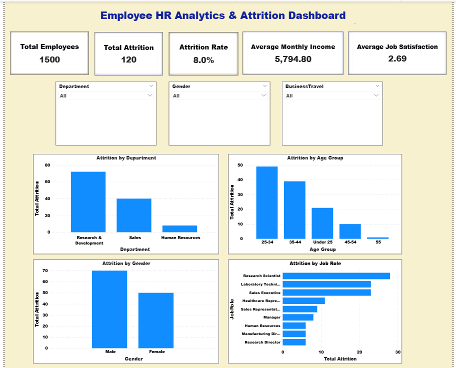
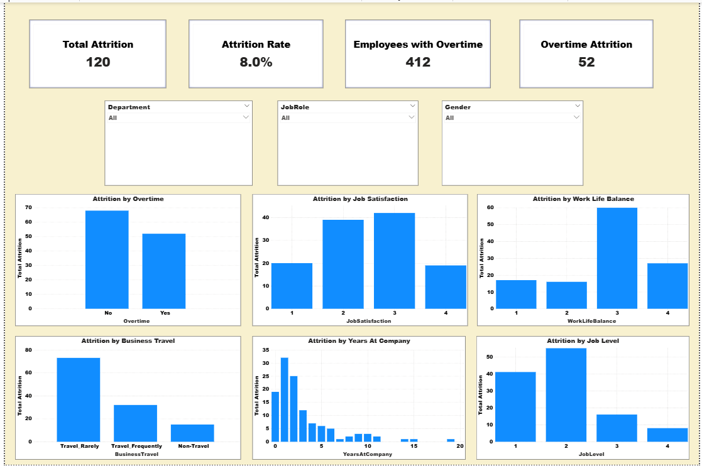
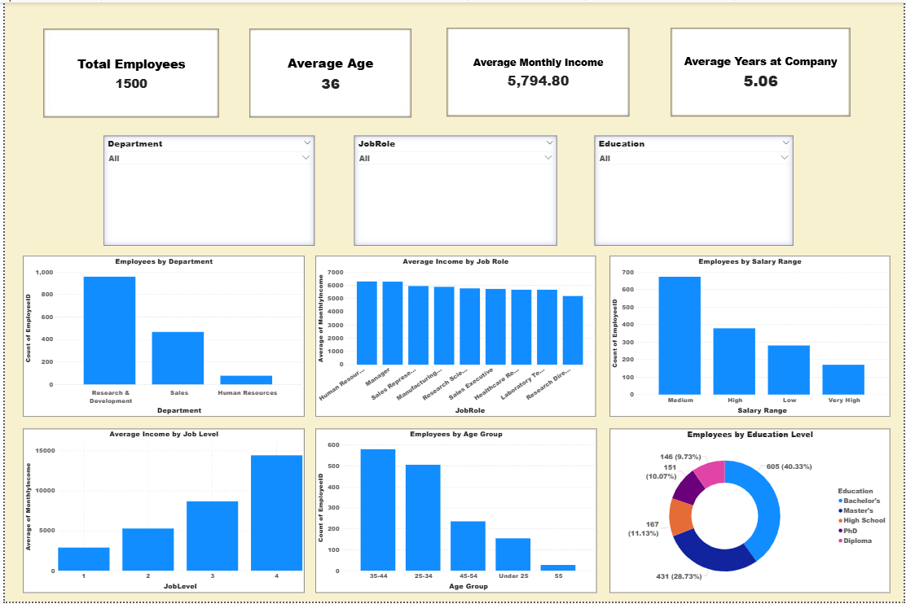

# Employee HR Analytics & Attrition Dashboard

## 📊 Project Overview

The Employee HR Analytics & Attrition Dashboard is an interactive
Power BI project designed to analyze employee demographics,
attrition, compensation, job satisfaction, and workplace factors.

The dashboard analyzes data for 1,500 employees and provides
interactive insights through KPI cards, charts, and slicers.

---

## 🛠️ Tools & Technologies

- Microsoft Power BI
- DAX
- Power Query
- Data Analysis
- Data Visualization
- Interactive Dashboards

---

## 📑 Dashboard Pages

### 1. HR Overview

Provides a high-level overview of the workforce and employee
attrition.

Key metrics include:

- Total Employees
- Total Attrition
- Attrition Rate
- Average Monthly Income
- Average Job Satisfaction
- Attrition by Department
- Attrition by Age Group
- Attrition by Gender
- Attrition by Job Role

### 2. Employee Attrition Analysis

Analyzes employee attrition across multiple workplace factors:

- Overtime
- Job Satisfaction
- Work-Life Balance
- Business Travel
- Years at Company
- Job Level

### 3. Employee Profile & Compensation

Provides insights into employee demographics and compensation:

- Employee Department
- Job Role
- Salary Range
- Job Level
- Age Group
- Education Level
- Monthly Income
- Years at Company

---

## 📈 Key Features

- Interactive KPI cards
- Interactive slicers
- DAX measures
- HR analytics
- Employee attrition analysis
- Compensation analysis
- Demographic analysis
- Interactive Power BI visualizations

---

## 🎯 Project Objective

The objective of this project is to transform employee HR data into
interactive visual insights that can help identify workforce patterns,
attrition trends, compensation patterns, and employee characteristics.

---

## 📷 Dashboard Preview

### HR Overview

### Employee Attrition Analysis

### Employee Profile & Compensation

---

## 📊 Dashboard Summary

| Page | Focus |
|---|---|
| HR Overview | Workforce and attrition overview |
| Employee Attrition Analysis | Attrition factors |
| Employee Profile & Compensation | Demographics and compensation |

---

## 👤 Author

Dhanush
